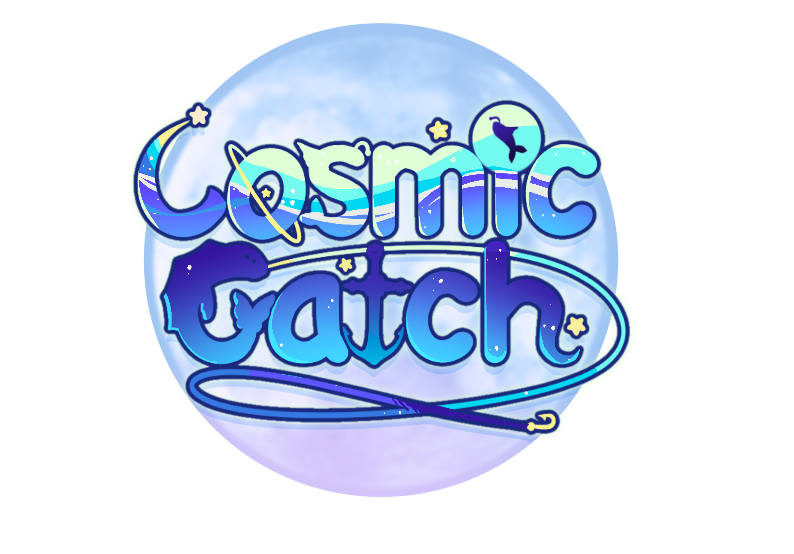

<h1 align="center">Cosmic Catch: An Intergalactic Food Truck Adventure 🍗🚚</h1>

Cosmic Catch is a unique and enjoyable gaming experience that combines elements of fishing, cooking, and space adventure. In this game, the player travels to different planets and environments to collect ingredients, fish for rare catches, and cook up dishes to serve customers. The more successful the player is, the more upgrades and improvements they can make to their food truck, equipment, and cooking skills. The ultimate goal is to become the best food truck in the galaxy, by preparing to the intergalactic cook-off happening on planet Daucus carota.

## About :information_source:

Our Game writing in C++ and use the Unreal Engine 5.

The game was develop for the program of Game Programming and Design of Humber College

To View Our Project GDD <a href ="https://docs.google.com/document/d/1z9bbO228pJGLcEswCIYL1J6K8Z5_Y8eXFhxP-M9GANo/edit?usp=sharing"> :open_book:</a>

Click On <code></code> To Go To Our Public Trello Board

## Controls

### PC Controls

    
Fishing Controls 

    &nbsp;  - Space: Cast line, Sink Anchor
     
    &nbsp; - WASD Keys: Change fishing angle
     
    &nbsp;  - Left Mouse Button: Set hook
     
    &nbsp; - Right Mouse Button: Reel in line
     

   
Cooking Controls 

   &nbsp; - Mouse: Move ingredients
     
    &nbsp; - WASD Keys: Rotate ingredients
     
    &nbsp; - Left Mouse Button: Pick up/drop ingredients
     
    &nbsp; - Right Mouse Button: Use utensils
     
    &nbsp; - E Key: Season dish
     
    &nbsp; - Q Key: Plate dish
     

   
Food Truck Controls 

&nbsp;- WASD Keys: Move food truck
  
&nbsp;- Mouse: Rotate food truck
  
&nbsp;- Left Mouse Button: Interact with environment
  
&nbsp;- Right Mouse Button: Open menu/inventory
  
&nbsp;- Spacebar: Accelerate
  
&nbsp;- Shift Key: Brake

<!-- TODO add this section only if we finish it -->
<!-- ### Console Controls

   
Fishing Controls

    &nbsp;- Left Joystick: Reel in or cast line
     
    &nbsp;- Right Joystick: Change fishing angle
     
    &nbsp;- A button: Set hook
     
    &nbsp;- B button: Reel in line

   
Cooking Controls

        &nbsp;- Left Joystick: Move ingredients
         
        &nbsp;- Right Joystick: Rotate ingredients
         
        &nbsp;- A button: Pick up/drop ingredients
         
        &nbsp;- B button: Use utensils
         
        &nbsp;- X button: Season dish
         
        &nbsp;- Y button: Plate dish

   
Food Truck Controls

        &nbsp;- Left Joystick: Move food truck
         
        &nbsp;- Right Joystick: Rotate food truck
         
        &nbsp;- A button: Interact with environment
         
        &nbsp;- B button: Open menu/inventory
         
        &nbsp;- X button: Accelerate
         
        &nbsp;- Y button: Brake

### Mobile Controls

   
Fishing Controls

        &nbsp;- Swipe left/right: Reel in or cast line
         
        &nbsp;- Swipe up/down: Change fishing angle
         
        &nbsp;- Tap: Set hook
         
        &nbsp;- Hold: Reel in line

   
Cooking Controls

        &nbsp;- Drag: Move ingredients
         
        &nbsp;- Swipe: Rotate ingredients
         
        &nbsp;- Tap: Pick up/drop ingredients
         
        &nbsp;- Hold: Use utensils
         
        &nbsp;- Double Tap: Season dish
         
        &nbsp;- Triple Tap: Plate dish

####

   
Food Truck Controls

&nbsp;- Swipe left/right: Move food truck
 
&nbsp;- Swipe up/down: Rotate food truck
 
&nbsp;- Tap: Interact with environment
 
&nbsp;- Hold: Open menu/inventory
 
&nbsp;- Accelerometer: Accelerate/Brake

 -->

## Visual Style

<!-- TODO add some examples -->

- Colorful and Vibrant
- Cartoonish and Whimsical
- Futuristic
- Detailed and Realistic
- Hand-drawn

## Music

- Upbeat and Lighthearted
- Space-themed
- Catchy and Memorable
- Dynamic

## About the team :star2:

<!-- TODO  add all the members of this project -->

The team consists of 23 artist and 15 programmers.
 
the programmers consists of :
<a href="https://www.linkedin.com/in/dorz/">Dor Zairi</a>,
<a href="https://www.linkedin.com/in/moses-mckeon-90212a221/">Moses Mckeon</a>,
<a href="https://www.linkedin.com/in/dorz/">Maxwell Donnelly</a>,
<a href="https://twitter.com/Akuzukii">Dominic Maximo</a>,
<a href="https://www.linkedin.com/in/william-huang-759a3921b">William Huang</a>,
<a href="https://www.linkedin.com/in/antoniukoff/">Vlad Antoniuk</a>,
<a href="https://www.linkedin.com/in/jacob-bruce-93224522b/">Jacob Bruce</a>,
<a href="https://www.linkedin.com/in/aaron-martin-bloom-34050a231/">Aaron Martin-Bloom</a>,
<a href="https://www.linkedin.com/in/zavior-stephenson-87254b19b/">Zavior Stephenson</a>,
<a href="https://ca.linkedin.com/in/ryler-bleau-359013206">Ryler B.</a>,
<a href="https://www.linkedin.com/in/gage-morash-a70131196/">Gage Morash</a>

 
the artist consists of :
<a href="https://www.linkedin.com/mwlite/in/ariel-lima-702291269">Ariel</a>,
<a href="https://www.linkedin.com/in/c-f-émilie-194a07268/">Emilie</a>,
<a href="https://www.linkedin.com/in/jena-palma-thompson-b40b64239">Jena</a>,
<a href="https://www.linkedin.com/in/sonalika-bansiwal-721b21219">Sonalika</a>,
<a href="https://www.linkedin.com/in/ariana-yang-94b165259/">Ariana</a>,
<a href="https://www.linkedin.com/in/carlos-iglesias-fu-460094149/">Carlos</a>,
<a href="https://www.linkedin.com/in/linh-luu-b44b61233">Linh</a>,
<a href="https://www.linkedin.com/in/sam-sameni-aa4609221">Sam</a>,
<a href="https://www.linkedin.com/in/dueol-lee-endjfcar/">Dueol</a>,
<a href="https://www.linkedin.com/in/itsabelle">Isabelle</a>,
<a href="https://www.linkedin.com/in/kyla-evans-48a106217/">Kyla</a>,
<a href="https://www.linkedin.com/in/jolene-sollner-48b768220">Jolene</a>,

###### Programmers Roles In The Project

<!-- TODO add all the programmers and their role -->

|                                            Name                                            |             Role              |
| :----------------------------------------------------------------------------------------: | :---------------------------: |
|                 <a href="https://www.linkedin.com/in/dorz/">Dor Zairi</a>                  |         Project Lead          |
|       <a href="https://www.linkedin.com/in/moses-mckeon-90212a221/">Moses Mckeon</a>       |         Project Lead          |
|        <a href="https://www.linkedin.com/in/jacob-bruce-93224522b/">Jacob Bruce</a>        |         Project Lead          |
| <a href="https://www.linkedin.com/in/aaron-martin-bloom-34050a231/">Aaron Martin-Bloom</a> |         Gameplay Lead         |
|        <a href="https://www.linkedin.com/in/gage-morash-a70131196/">Gage Morash</a>        | Level Design & game mode Lead |
|          <a href="https://ca.linkedin.com/in/ryler-bleau-359013206">Ryler B.</a>           |            UI Lead            |
|                 <a href="https://twitter.com/Akuzukii">Dominic Maximo</a>                  |         Level Design          |
|                           <a href="https://twitter.com">Cole</a>                           |         Level Design          |
|     <a href="https://www.linkedin.com/in/moses-mckeon-90212a221/">Maxwell Donnelly</a>     |           GamePlay            |
|  <a href="https://www.linkedin.com/in/zavior-stephenson-87254b19b/">Zavior Stephenson</a>  |           Gameplay            |
|      <a href="https://www.linkedin.com/in/william-huang-759a3921b">William Huang</a>       |              UI               |
|            <a href="https://www.linkedin.com/in/antoniukoff/">Vlad Antoniuk</a>            |              UI               |

###### Artists Roles In The Project

<!-- TODO add all the artists and their role -->

|                                      Name                                      |          Role          |
| :----------------------------------------------------------------------------: | :--------------------: |
|  <a href="https://www.linkedin.com/mwlite/in/ariel-lima-702291269">Ariel</a>   |      Project Lead      |
|     <a href="https://www.linkedin.com/in/c-f-émilie-194a07268/">Emilie</a>     |      Project Lead      |
| <a href="https://www.linkedin.com/in/carlos-iglesias-fu-460094149/">Carlos</a> | level design team lead |
| <a href="https://www.linkedin.com/in/sonalika-bansiwal-721b21219">Sonalika</a> | level design team lead |
|                                Slab Bannenberg                                 | level design team lead |
|      <a href="https://www.linkedin.com/in/kyla-evans-48a106217/">Kyla</a>      | SFX and VFX team lead  |
|    <a href="https://www.linkedin.com/in/ariana-yang-94b165259/">Ariana</a>     | SFX and VFX team lead  |
|       <a href="https://www.linkedin.com/in/sam-sameni-aa4609221">Sam</a>       |   lighting team lead   |
|                                      Jena                                      | environment team lead  |
|      <a href="https://www.linkedin.com/in/dueol-lee-endjfcar/">Dueol</a>       | environment team lead  |
|  <a href="https://www.linkedin.com/in/jena-palma-thompson-b40b64239">Jena</a>  |  GamePlay Programmer   |
|    <a href="https://www.linkedin.com/in/linh-luu-b44b61233"> Linh lee </a>     |  level design artist   |
|          <a href="https://www.linkedin.com/in/itsabelle">Isabelle</a>          |       UI artists       |
|   <a href="https://www.linkedin.com/in/jolene-sollner-48b768220">Jolene</a>    |    Lighting artist     |
|                                                                                |                        |

# Tech That Was Used In The Project 👩‍💻

<!-- TODO add more tech to this section -->

 - Unreal Engine

 - Bash

 - Git

 - C++

 - Photoshop

 - blender

 - 3ds Max

<!-- TODO make a gif for the game -->
<!-- # Show Case -->

<!-- ### Attack

### Block

### Dodge

 -->
